# PJ Machine
The PJ Machine (Publishing Jockey Machine) is a box with arcade buttons to control a node js web interface for live publishing. 
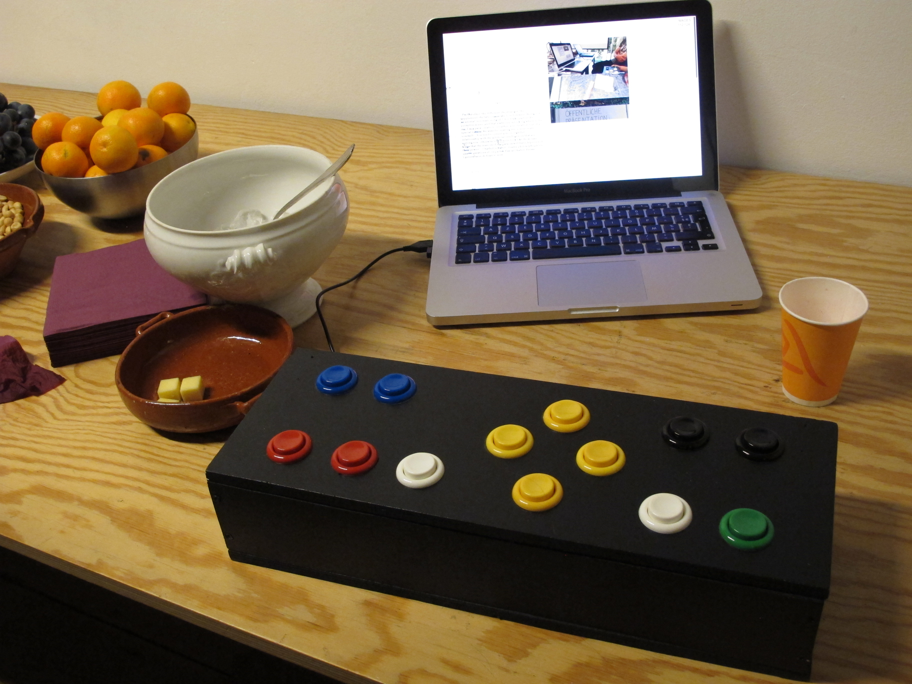

## What ? 
### Degré 48

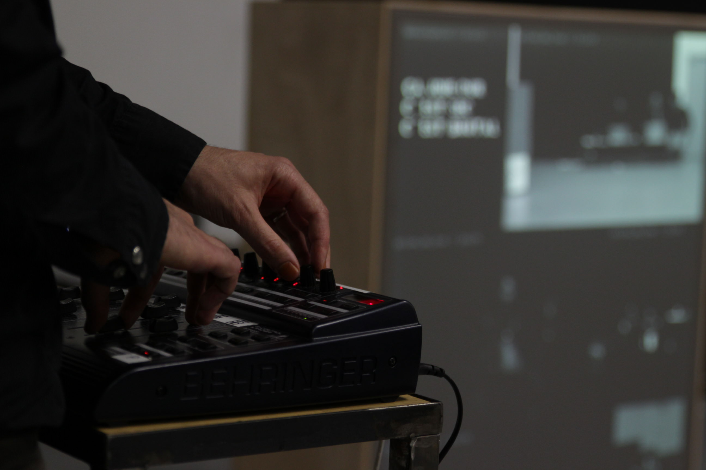
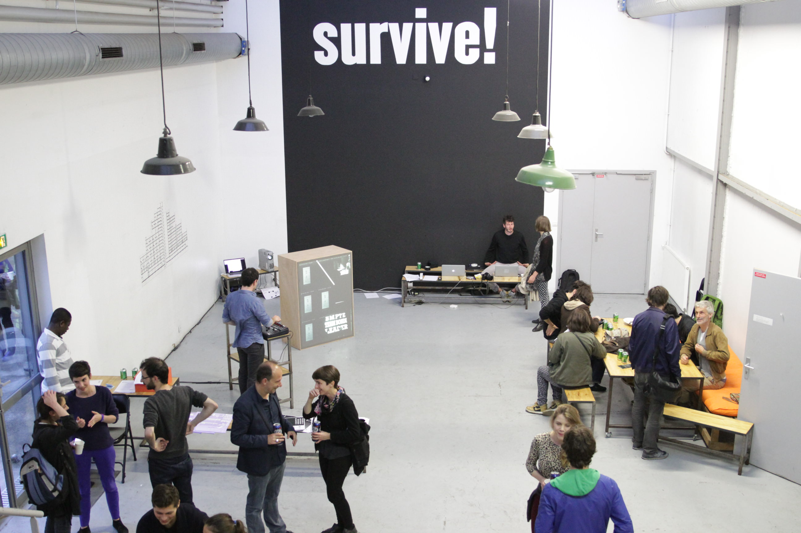
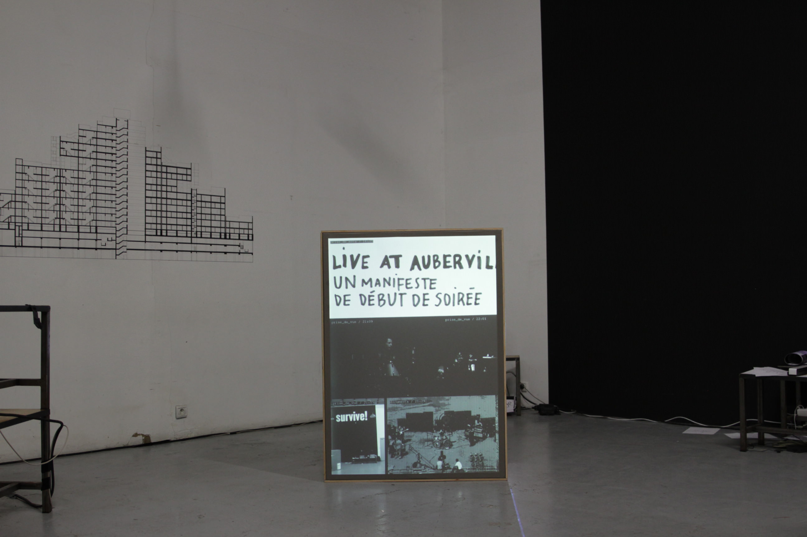
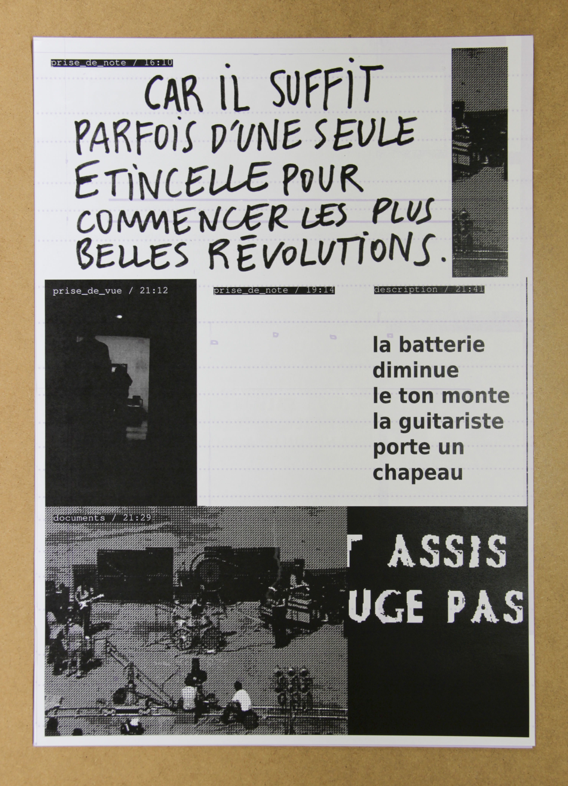

### Frankenstein Revisited
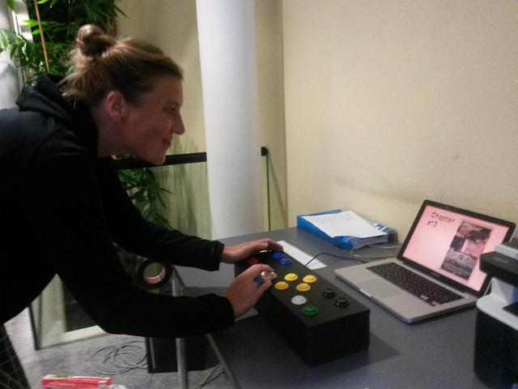
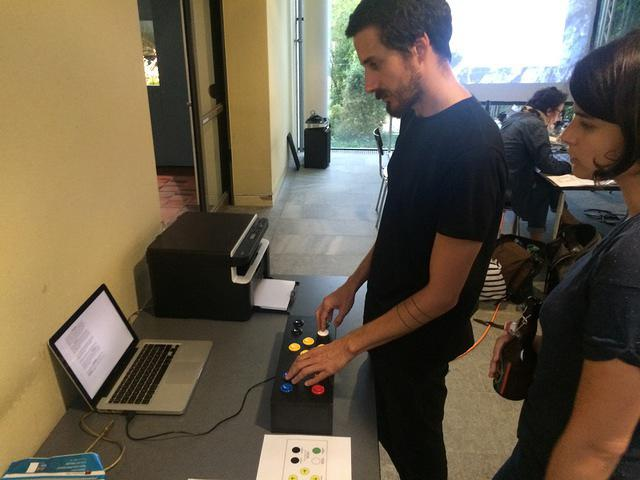
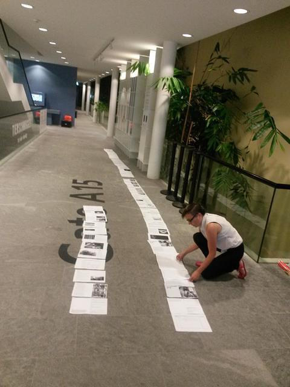
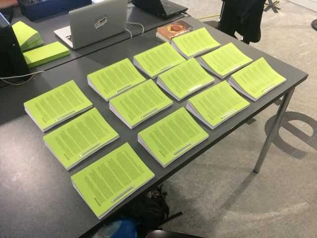
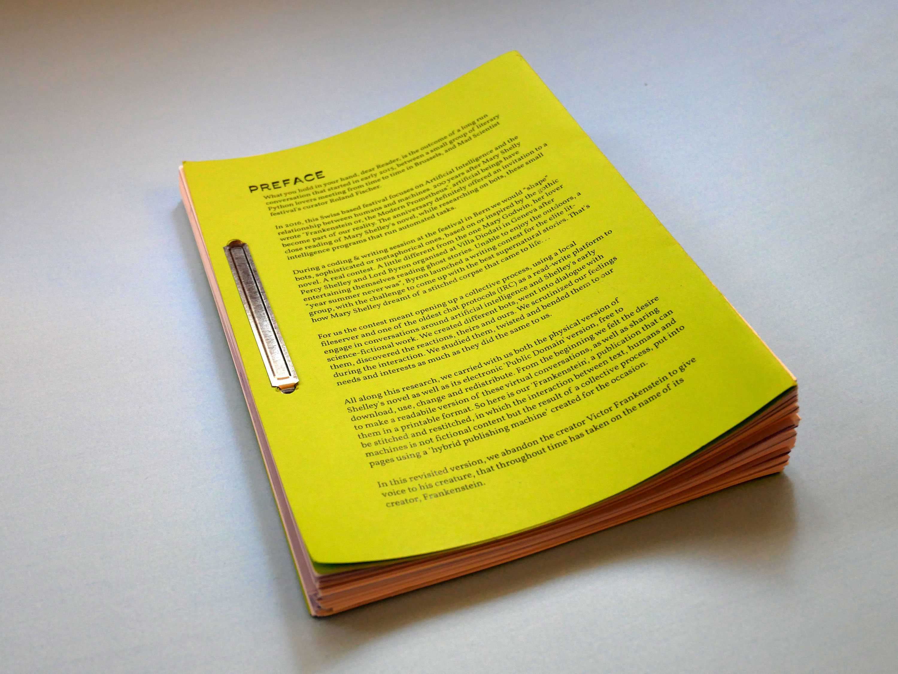

### Transmediale Machine Research Workshop
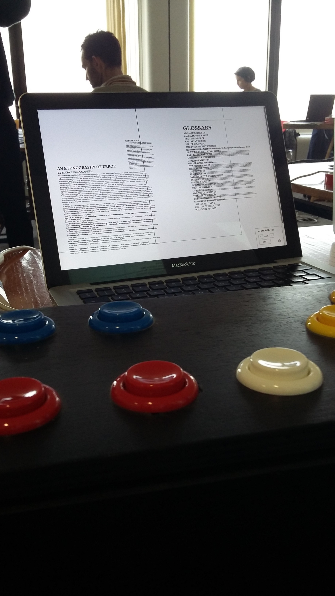
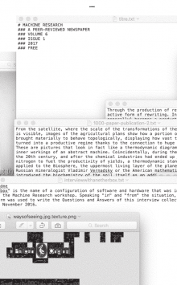

### Alternative publishing tools
http://computedlayout.tumblr.com/  
http://www.indianen.be/work/longhand-publishers  
http://banc.g-u-i.net/dispositifs/compte-fil  

## Materials for the workshop
- Makey-Makey (http://www.makeymakey.com/)
- Arduinos
- Buttons
- Joystick
- Potentiometers
- Smartphone
- Paper
- Printer
- Cardboard

## Installation

### Dependencies

Install [node.js](https://nodejs.org/)

#### 1. Download this repository

Click on *Clone or Download* in the top right corner of this page, then *Download ZIP*. Unpack this folder.

#### 2. Open a terminal window

Open a terminal window to execute commands and install the programm.

- macOS: go to Applications -> Utilities -> Terminal
- Linux: use a terminal app such as Terminal or Konsole

In your terminal, navigate to the pj-machine folder with your terminal using the `cd` command:
```
cd path/to/pj-machine
```

#### 3. Install dependencies

Install dependencies (may take up to 5 minutes):

```
npm install
```  
 
#### 4. Run PJ Machine

Start the node server folder with the following command:
```
node server.js
```
Go to http://localhost:1337 in your favorite browser

To stop the server: ctrl + c in terminal

---

# Documentation

## App architecture

- ```content ```  
    - ```data ```  
    folder where the content is stored  
        - ```blocks  ```
        add folder here to add a block to your project   
        (see “How to add content” in the documentation)  
        - ```data.md```  
        a setting file for data, we don’t need it  
        - ```page.json ```   
        edit this file to change your page settings (size and margin)  
        (see “Page settings” in the documentation)  
        - ```pdf  ```
        folder where pdf are exported   
        - ```settings.js  ```
        edit this file to change app settings  
        (see “App settings” in the documentation)  

- ```main.js  ```  
Node serveur file — In this file you can add server functions.  
We will use it mainly to add Arduino code  
(see “Arduino and Nodejs” in the documentation)

- ```public ```    
    - ```js```  
        - ``` create-page.js```  
        js file that load the content and display every block correctly
    
        - ```interface-events.js```  
        js functions for interface (grid, zooming in page, preview etc.)
    
        - ```pj-receive-events.js```  
        functions to call when you make a move on a block  
        (see “Adding new features” in the documentation)

        - ```pj-send-events-keypress.js```  
        js functions send events from keypress 
    
        - ```pj-send-events.js```  
        add your own events functions here  
        (see “Adding new features” in the documentation)

        - ``` poster.js```  
        main javascript client-side file for poster page

    - ```css```
        - ```public.css```  
        Write your own css here  
        (see “Adding / Changing style (css or sass)” in the documentation)
   
    - ```sass ```
        - ```style.scss```  
        Write your own sass here  
        (see “Adding / Changing style (css or sass)” in the documentation)

- ```views```  
Folder where html files are stored. I’m using a html template named jade  
    - ```index.jade```  
    main jade / html file  
    (see “Adding / Changing html (jade)” in the documentation)

## Keyboard events
The PJ Machine has some functions include by default you can use. 
All functions can be fired by a keypress. 

- O > Go to previous content
- P > Go to next content
- A > Move Left
- Q > Move Right 
- W > Move Down
- S > Move Up
- U > Zoom In 
- Space Bar > Zoom Out
- I > Decrease block width
- E > Increase block width
- Y > Increase letter spacing
- R > Decrease letter spacing
- N > Change font (random in an array of fonts)
- B > Change color (random)
- M > Rotate Clockwise
- L > Rotate Counterclockwise
- T > Generate PDF

## Connecting to the same PJ Machine with another device (Multiplayer Mode)
- Connect the devices on the same wifi 
- Run the app on a computer (after installing all dependencies)
    - Open the terminal and run ```node server.js```
    - Get the IP address of the computer (go to network settings to find it)
    - Go to http://IPaddress:1337 (replace IPaddress by server IP address you find before) on another device (could be smartphone, tablet, another computer) 


## How to add content 
- Go to PJ Machine folder 
- Open ```content/blocks``` folder
- Here you have all the content folders
- One folder = a block on the PJ Machine interface
- Copy paste the example-folder you find here into ```content/blocks```
- Rename the folder with the next number 
- Open data.txt — data.txt are files where block data are stored
- Change the path replacing example-folder by the name of your folder
- Change the index: By the position of your folder. If your folder is the sixth folder change index to 6. All folders should have an unique index.
- Change the content.
- Reload the server:
Go to the terminal and stop the server: ```ctrl + C``` and then ```node server.js```

The content should be written in markdown. 

### Markdown memo

```# Big Title (h1)```  
```## Sub Title (h2)```  
```### Sub Sub Title (h3)```  
```#### Sub Sub Sub Title (h4)```  
```#### Sub Sub Sub Sub Title (h5)```  
```**Bold**```  
```*Italic*```  

#### Add an image
- Add your image in the folder   
``````
- Or add an image from the web
`````` 

## Page settings
You can easily change the page settings: size, scale and margins
- Open ```content/page.json```
- Change the data here
- Run ```gulp``` in the terminal
- Reload the server and reload you page in browser

## App settings
- Open ```content/settings.js```
- Change the data (documentation in the file) 
In this file you can change the name of your project and settings for some functions as zoom, move and rotate. 
- Restart the server and reload you page in browser


## Arduino and Nodejs
To work with Arduino and Nodejs, we use the Johnny-Five node module.
You can find the documentation and examples here: http://johnny-five.io/examples/

An example is setting up in the PJ Machine. You can plug a joystick and move blocks with it. 

### Joystick and Jonnhy-Five 
- Plug Joystick to Arduino, like this
	•	Ground - wired to the ground rail
	•	+5V - wired to the power rail
	•	VRx - the “X” value of the joystick, wired to Analog In 0
	•	VRy - the “Y” value of the joystick, wired to Analog In 1
- Documentation for joystick and node is here: http://johnny-five.io/examples/joystick/
- Code for joystick is in the main.js file line 71
- Run ```node server.js``` in the terminal 
- If you have an error, follow these instructions: 
https://github.com/rwaldron/johnny-five/wiki/Getting-Started#trouble-shooting

### Adding Arduino code
- Open main.js file
- Write your code below the Arduino joystick function call line 41
Functions are presetted in the program. 
Write your code in the server-side and send the data to the client-side.

Syntax to broadcast data in real time from server side to client side: ```io.sockets.emit(“nameOfEvent”, data);```

The list of functions and how to use it:

#### Change block 
Changing the selected block to act on. 
```io.sockets.emit("arduinoChangeBlock", direction);```
Where direction should be “next” or “prev”

#### Move the block
Moving the block up, down, left and right
```io.sockets.emit("arduinoMove", direction);```
Where direction should be “up”, “down”, “left” or “right”

#### Zoom In / Zoom Out in block
```io.sockets.emit("arduinoZoomBlock", direction);```
Where zoom should be “zoomin” or “zoomout”

#### Change the size of a block
```io.sockets.emit("arduinoChangeBlockSize", direction);```
Where direction should be “decreaseSize” or “increaseSize”

#### Change letter spacing
```io.sockets.emit("arduinoChangeWordSpacing", direction);```
Where direction should be “decreaseSpacing” or “increaseSpacing”

#### Change the font
```io.sockets.emit("arduinoChangeFont", direction);```
Where font is the name of the font.
List of fonts available in the PJ Machine
"aileron", "fira", "inknut", "nanook", "reglo", "roboto", "terminal", "vollkorn"

#### Change the font color
```io.sockets.emit("arduinoChangeColor", direction);```
Where color is the color you want for your font (color can be in hex or rgb)

#### Rotate the block
```io.sockets.emit("arduinoRotateBlock", direction);```
Where direction should be “clockwise” or “counterclockwise”

- When you want to test your code, restart the server and reload you page in browser

## Adding new features

### Sending events to server 
At this time PJ Machine is working with keypress. 
The programm is calling a function relative to specific keys. 
If you want to change the kind of interaction in javascript, you could get the data from where you want and send them to the server. 
Write your code in the ```public/js/pj-send-events.js``` file (jquery is installed)

Functions are pre-defined, and can be used easily.

The list of functions: 

#### Change block 
Changing the selected block to act on. 
```sendEvent('changeBlock', direction);```
Where direction should be “next” or “prev”

#### Move the block
Moving the block up, down, left and right
```sendEvent('moveBlock', direction);```
Where direction should be “up”, “down”, “left” or “right”

#### Zoom In / Zoom Out in block
```sendEvent('zoomBlock', zoom);```
Where zoom should be “zoomin” or “zoomout”

#### Change the size of a block
```sendEvent('changeBlockSize', direction);```
Where direction should be “decreaseSize” or “increaseSize”

#### Change letter spacing
```sendEvent('changeWordSpacing', direction);```
Where direction should be “decreaseSpacing” or “increaseSpacing”

#### Change the font
```sendEvent('changeFont', font);```
Where font is the name of the font.
List of fonts available in the PJ Machine
"aileron", "fira", "inknut", "nanook", "reglo", "roboto", "terminal", "vollkorn"

#### Change the font color
```sendEvent('changeColor', color);```
Where color is the color you want for your font (color can be in hex or rgb)

#### Rotate the block
```sendEvent('rotateBlock', direction);```
Where direction should be “clockwise” or “counterclockwise”

## Adding / Changing style (css or sass)

### CSS 
Add your own css in ```public/css/public.css```

### SASS
If you feel sassy, you can add your style with sass in ```public/sass/style.scss```
Then run ```gulp``` in the terminal (you need to have gulp install)

## Adding / Changing html (jade)
The program is using a html template named jade.
Changing jade in ```views/index.jade```
Jade documentation: https://naltatis.github.io/jade-syntax-docs/
Html to Jade Converter: http://html2jade.org/

---

## License 
GPL v.3


